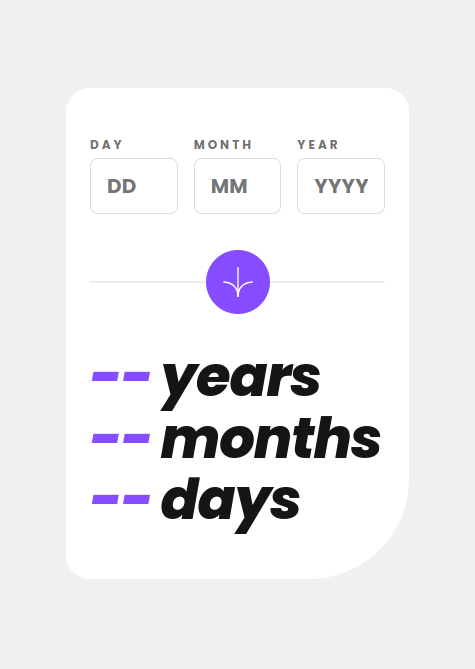
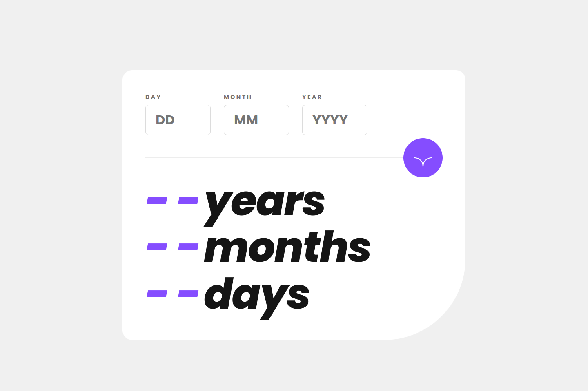

# Frontend Mentor | Age calculator app
This is my solution to the [Age calculator app challenge](https://www.frontendmentor.io/challenges/age-calculator-app-dF9DFFpj-Q) from [Frontend Mentor](https://www.frontendmentor.io/).

## Tech Stack
- Angular 17
- Sass

## Main Features
- Prerendering
- Cross-field custom validator
- Jasmine unit testing
- Age computation animation (JavaScript-based)
- Self-hosted fonts (downloaded from [Google Fonts](https://fonts.google.com/))
- Bash automation (see [PR #1](https://github.com/johnnygerard/fem-age-calculator-app/pull/1))
- GitHub Actions:
  - Vercel deployments
  - CodeQL analysis

## Developer Tools
- VS Code
- Figma
- GitHub Copilot

## Links
- [Website](https://fem-age-calculator-app-jgerard.vercel.app) hosted with [Vercel](https://vercel.com/)
 <!-- - [Solution]() -->

## Screenshots
### Mobile

### Desktop

## About Frontend Mentor
[Frontend Mentor](https://www.frontendmentor.io/) challenges help you improve your coding skills by building realistic projects.

## Copyright
© 2024 Johnny Gérard
